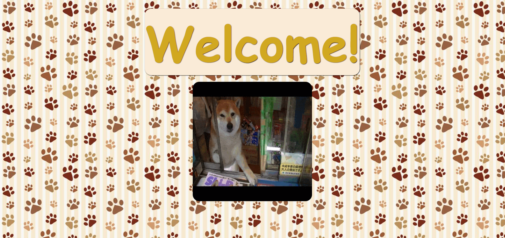
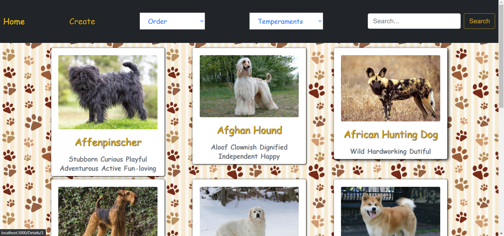
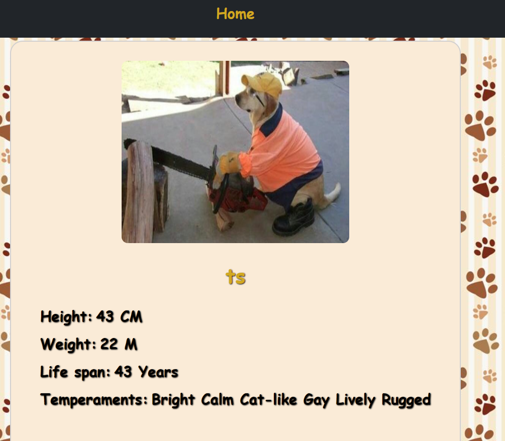
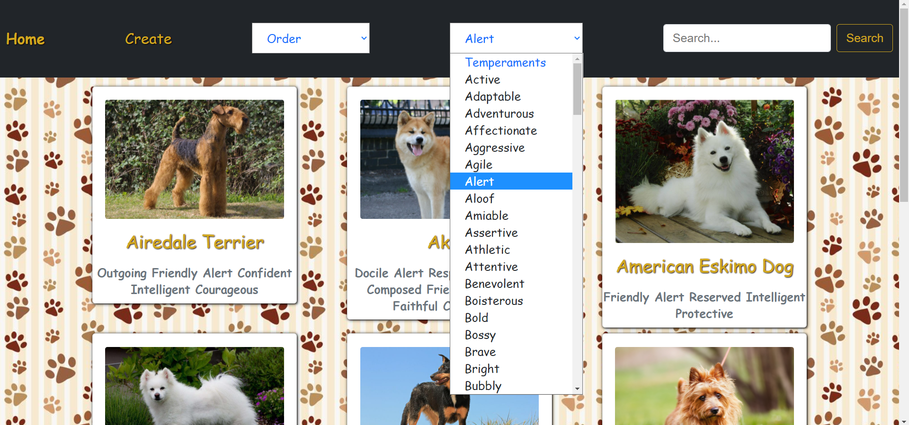
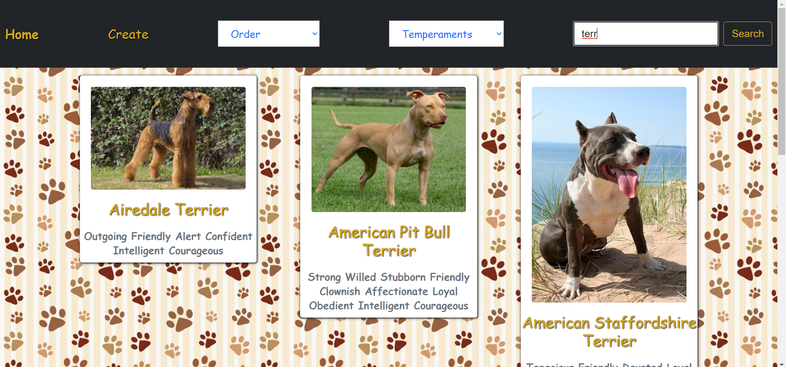
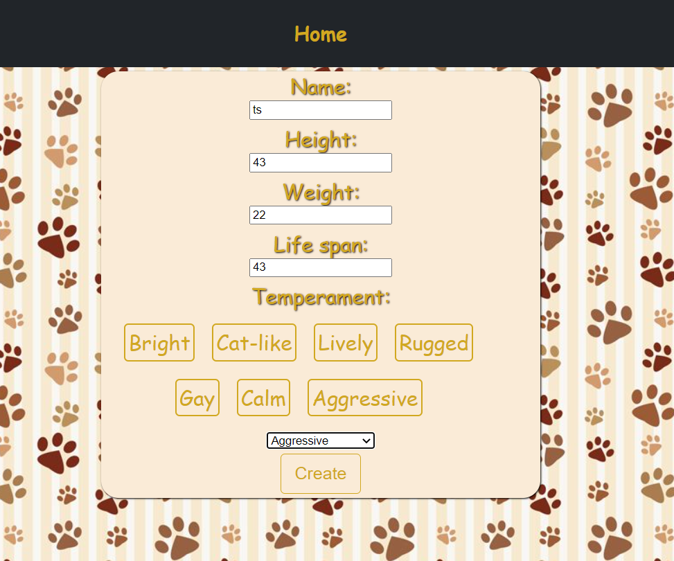
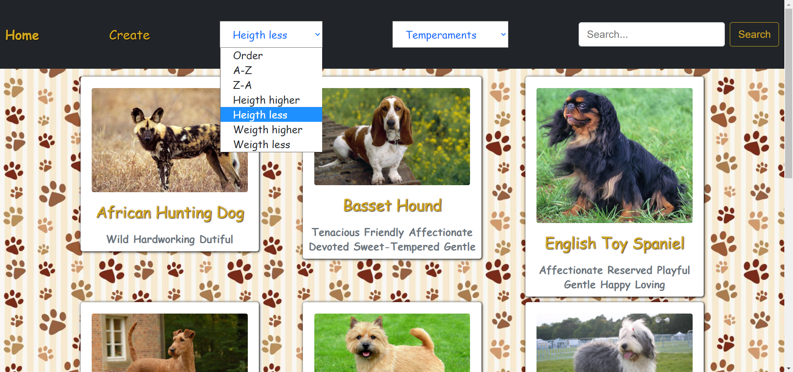

Para poder utilizar este proyecto, tienes que crearte una base de datos con el nombre dogs y en la consola, dentro de api y dentro de client hacer el npm instal 
Por ultimo npm start en estos mismos 

    <h1>Vista previa</h1>
    

        <h3> Landing page</h3>
        
        <h3> Home</h3>
        
        <h3> Detalles</h3>
        
        <h3> Filtrado temperamentos</h3>
        
        <h3> Busqueda</h3>
        
        <h3> Crear perros</h3>
        
        <h3> Ordenamientos</h3>
        
    

